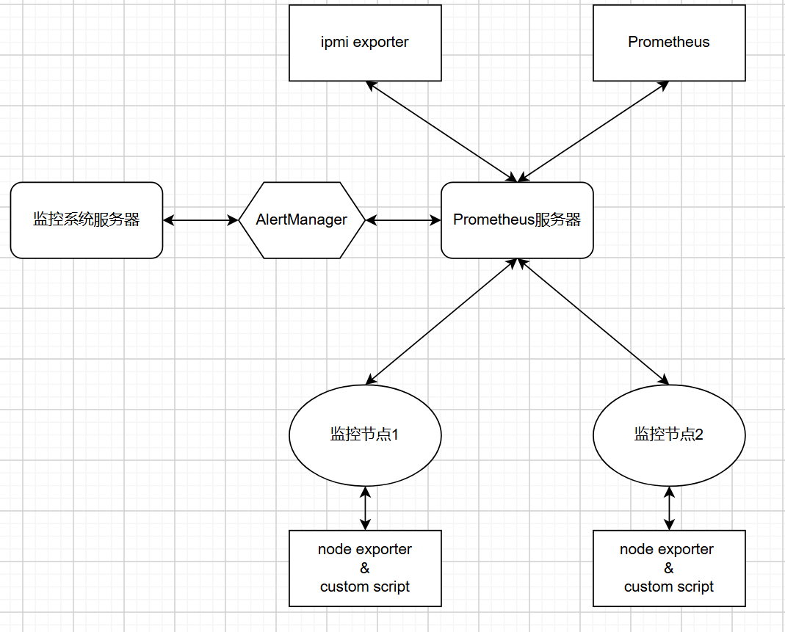

# 高性能服务器监控系统用户手册

## 一、部署

在本系统中，有三类主要的服务器。

- **监控系统服务器**：用于部署我们的监控系统，主要用于展示警报，管理设备。通过`Alertmanager`与`Prometheus`服务器交互。
- **Prometheus服务器**：部署`Prometheus`系统，直接监控多个监控节点，需配置`Prometheus`和`ipmi exporter`
- **监控节点**：每个节点都需要部署`node exporter`，以及运行自定义脚本。



### 前期准备

- 下载git仓库中的`/deploy`文件夹，里面有重要的配置文件

### 被监控节点端

#### 部署`node exporter`

1. 首先下载`/collectors`文件夹，里面有必要的脚本。

2. 在每个节点上都运行`collect_metrics.sh`自定义脚本，来收集node exporter无法收集的metrics。metrics文件的默认位置为`./metrics`。通过运行这段脚本，会在此文件夹下产生多个`.prom`文件。请留意`metrics`文件夹的位置，我们需要用它来配置node exporter。

3. 下载并配置node exporter

   - 如果有docker环境，可以使用`collectors/docker-compose.yml`来配置。注意，

     ```yaml
         volumes:
           - /proc:/host/proc:ro
           - /sys:/host/sys:ro
           - /:/rootfs:ro
           - ./metrics:/metrics:ro  #change this line to actual path of metrics files
           - <actual path to the custom metrics directory>:/metrics:ro  
     ```

   - 没有docker环境的情况下，请从官网下载二进制文件

     1. 下载安装教程如下 https://prometheus.io/docs/guides/node-exporter/#installing-and-running-the-node-exporter。 注意，对于被监控的服务器，只需要安装node exporter，不需要配置Prometheus。
     
     2. 下载安装完成node exporter后，启动node exporter
        1. 手动启动情况下，在安装目录下使用命令  
           - `./node_exporter --collector.textfile.directory=<actual path to /metrics>`
           
        2. 使用systemd来运行的话，需更改配置文件
           - `sudo nano /etc/systemd/system/node_exporter.service`
           
             ```bash
             [Unit]
             Description=Node Exporter
             After=network.target
             
             [Service]
             User=node_exporter
             ExecStart=/usr/local/bin/node_exporter --collector.textfile.directory=/<actual path to /metrics>
             Restart=always
             
             [Install]
             WantedBy=multi-user.target
             
             ```
           
           - 并且重启服务
           
             - `sudo systemctl daemon-reload`
             - `sudo systemctl start node_exporter`
             - 如果需要的话，`sudo systemctl enable node_exporter` ,使得node exporter会在主机启动后自动启动
             - 检查`sudo systemctl status node_exporter`是否为active

4. 测试node exporter

   1. 首先打开http://localhost:9100/metrics, 检查是否有数据。应有类似如下数据

      ```bash
      # HELP go_gc_duration_seconds A summary of the GC invocation durations.
      # TYPE go_gc_duration_seconds summary
      go_gc_duration_seconds{quantile="0"} 3.8996e-05
      go_gc_duration_seconds{quantile="0.25"} 4.5926e-05
      go_gc_duration_seconds{quantile="0.5"} 5.846e-05
      # etc.
      ```

   2. 然后检查自定义监控脚本是否正确运行？

      1. 首先检查是否产生`/metrics`文件夹，以及里面是否存在`.prom`文件。如果`collect_metrics.sh`脚本运行正常，这些文件的内容应该会实时更新。
      2. 然后检查node  exporter运行过程中是否有报错
         - `sudo journalctl -u node_exporter`
3. 最后，检查http://localhost:9100/metrics里是否正确显示自定义metrics。如果没有对`collect_metrics.sh`脚本改动，应该会有`logged_in_user` 和`gpu_utilization`等metrics

### Prometheus服务器端

#### 部署`ipmi exporter`

[官方文档](https://github.com/prometheus-community/ipmi_exporter)

- 通过二进制文件

  - 从[官方发行网站](https://github.com/prometheus-community/ipmi_exporter/releases)下载最新的，适配服务器系统的`.tar.gz`文件。提取文件内容，`tar -xvzf ipmi_exporter.tar.gz`
  - 随后，将文件移到`/usr/local/bin`文件夹，`sudo mv ipmi_exporter /usr/local/bin/`
  - 创建systemd服务文件,`sudo nano /etc/systemd/system/ipmi_exporter.service`, 内容如下

  ```bash
  [Unit]
  Description=IPMI Exporter
  After=network.target
  
  [Service]
  ExecStart=/usr/local/bin/ipmi_exporter --config.file=<actual path to ipmi-exporter.yml>
  Restart=always
  
  [Install]
  WantedBy=multi-user.target
  
  ```

  - 重启服务

- 通过docker
- 安装测试
  - 安装完成后，我们可以通过打开[网址](http://localhost:9290)来测试是否正确运行。
  - 随后，我们需要在Prometheus中配置监控对象，以及一些其他配置。我们会在下个部分介绍。

#### 部署`Prometheus`

- 通过二进制文件

  - 通过[官方下载网站](https://prometheus.io/download/)下载适配的`.tar.gz`文件。
  - 同上，配置systemd文件

  ```bash
  [Unit]
  Description=Prometheus Monitoring System
  After=network.target
  
  [Service]
  User=prometheus
  Group=prometheus
  ExecStart=/usr/local/bin/prometheus \
      --config.file=<actual path to ur /prometheus.yml> \
      --web.enable-lifecycle \
  Restart=always
  
  [Install]
  WantedBy=multi-user.target
  ```

  - 同时，我们需要配置`targets.yaml`和`rule.yaml`。这两个文件都被包含在`deploy`文件夹中

    - `targets.yaml`: 我们需要更改为监控节点的bmc服务器地址，用于`ipmi exporter`来收集bmc信息，例如

    ```bash
    - targets: [11.11.3.101, 11.11.3.102, 11.11.3.103, 11.11.3.104]
      labels: {job: ipmi_exporter}
    ```

    - `rule.yaml`: 我们可以修改，来自定义规则

  - 在`prometheus.yaml`中，我们需要包含这两个配置文件的位置。

  ```bash
  # Rules and alerts are read from the specified file(s)
  rule_files:
    - <actual path to rule.yaml>
    ...
    
  scrape_configs:
    - job_name: ipmi
      params:
        module: [ 'default' ]
      # scrape_interval: 10s
      metrics_path: /ipmi
      scheme: http
      file_sd_configs:
        - files:
            - <actual path to tartgets.yaml>
  ```

  - 同时在`prometheus.yaml`中配置`Alertmanager`

    `Alertmanager`默认端口号为9093，可以根据实际情况更改
  
  ```yaml
  alerting:
    alertmanagers:
      - static_configs:
          - targets:
            - <alertmanager_address>:9093
  ```

- 安装测试

  - 安装完成后，我们可以通过打开[网址](http://localhost:9090)来测试是否正确运行。
  - 我们可以到[规则界面](http://localhost:9090/rule)和[目标界面](http://localhost:9090/targets?search=)来检测是否正确配置


### 监控主机端

#### Alertmanager

详见使用说明Alertmanager[安装与启动](#alertmanager)部分


## 二、使用说明

### Alertmanager

> [官方文档](https://prometheus.io/docs/alerting/latest/overview/)

#### 1. 概述

Alertmanager 是一个用于处理 Prometheus 等客户端应用程序发送的告警的工具。它主要功能包括：

- **告警分组**：将类似的告警整合为单一通知。
- **告警去重**：对重复告警进行去重，避免多次发送。
- **告警路由**：根据配置将告警发送到特定的接收器。
- **告警抑制**：在特定条件下抑制低优先级告警。
- **告警静默**：在指定时间段内禁用某些告警通知。

Alertmanager 可以与多种接收器集成（如邮件、Webhook、Slack 等），同时支持告警的抑制和动态配置。这里我们使用Webhook与后端服务器集成。

------

#### 2. 安装与启动<span id='alertmanager'></span>

##### docker环境部署

注：如设备支持docker环境，可以使用docker命令快捷部署：

先准备好`config.yaml`文件，详见[配置文件详解](#alertmanager_config)，或使用[配置示例](#alertmanager_config_example)快速部署

```bash
docker run -d \
  --name hpc-monitor-alertmanager \
  -p 9093:9093 \
  -v $(pwd)/alertmanager/config.yml:/etc/alertmanager/config.yml \
  -v $(pwd)/alertmanager/data:/alertmanager \
  prom/alertmanager:v0.25.0 \
  --config.file=/etc/alertmanager/config.yml
```

##### 通过二进制文件部署

从 [Prometheus 官方网站](https://prometheus.io/) 下载 Alertmanager 二进制文件并解压。

**启动命令：**

```bash
./alertmanager --config.file=config.yaml
```

- 使用 `--config.file` 参数指定配置文件路径。

##### 配置热加载

运行时可通过以下两种方式重新加载配置：

1. 向 Alertmanager 进程发送 SIGHUP 信号。

2. 使用 HTTP API：

   ```bash
   curl -X POST http://<alertmanager_address>/-/reload
   ```

------

#### 3. 配置文件详解 (`config.yaml`)<span id='alertmanager_config'></span>

以下为 Alertmanager 配置文件的核心部分及解释：

##### Global 配置

```
yaml复制代码global:
  resolve_timeout: 30s  # 告警从 "firing" 状态切换到 "resolved" 状态的超时时间
```

- **resolve_timeout**：默认超时时间为 `5m`，定义告警解决后通知接收器的延迟。

##### Route 配置

```
yaml复制代码route:
  group_by: ['alertname']  # 按照 alertname 对告警进行分组
  group_wait: 10s          # 首次告警触发后等待的时间
  group_interval: 5m       # 分组内告警的通知间隔
  repeat_interval: 1h      # 相同告警的重复通知间隔
  receiver: 'webhook-alert'  # 默认接收器
```

- **group_by**：定义分组依据（如 `alertname`）。支持 `'...'` 表示按所有标签分组。
- **group_wait**：指定第一个告警触发后，等待后续告警合并的时间。
- **group_interval**：分组告警通知之间的最小间隔时间。
- **repeat_interval**：对相同告警的重复通知间隔时间。
- **receiver**：指定默认接收器。

##### Receivers 配置

```yaml
receivers:
  - name: 'webhook-alert'
    webhook_configs:
      - url: <webhook_url>
```

- **name**：接收器名称。
- **webhook_configs**：Webhook 配置，告警将以 HTTP POST 的形式发送到指定的 URL。

------

#### 4. 核心功能解析

##### 4.1 告警分组（Grouping）

将类似的告警整合成单个通知，以减少大规模故障期间的通知数量。

- 通过 `group_by` 定义分组依据。
- 通过 `group_wait` 和 `group_interval` 控制通知时机。

##### 4.2 告警抑制（Inhibition）

当高优先级告警触发时，抑制相关的低优先级告警。

- 在配置文件中通过 `inhibit_rules` 定义抑制规则。

- 示例：

  ```yaml
  inhibit_rules:
    - source_matchers:
        - alertname="HighClusterDown"
      target_matchers:
        - alertname="NodeDown"
      equal: ['cluster']
  ```

  此配置表示，当 `HighClusterDown` 告警触发时，将抑制与其 `cluster` 标签相同的 `NodeDown` 告警。

##### 4.3 静默时间（Mute Time Intervals）

可以通过 `mute_time_intervals` 定义在指定时间段禁用告警。

- 示例：

  ```yaml
  mute_time_intervals:
    - name: 'maintenance'
      time_intervals:
        - weekdays: ['saturday', 'sunday']
          times:
            - start_time: '09:00'
              end_time: '17:00'
  ```

------

#### 5. 配置示例 <span id='alertmanager_config_example'></span>

> 目前本系统配套的`Alertmanager`只配置了告警分组功能，后续如有需要可以按照文档继续添加配置

以下为完整的必要配置示例：

```yaml
global:
  resolve_timeout: 30s

route:
  group_by: ['alertname']
  group_wait: 10s
  group_interval: 5m
  repeat_interval: 1h
  receiver: 'webhook-alert'

receivers:
  - name: 'webhook-alert'
    webhook_configs:
      - url: 'http://172.18.6.108/api/alerts'
```

------

#### 6. 使用方法

1. **启动 Alertmanager** 使用以下命令启动服务：

   ```bash
   ./alertmanager --config.file=config.yaml
   ```

2. **发送测试告警** 使用 `curl` 测试 Webhook：

   ```bash
   curl -X POST -H "Content-Type: application/json" \
   -d '[{"labels":{"alertname":"TestAlert"}}]' \
   <webhook_url>
   ```

3. **验证接收器** 确保 Webhook 地址接收到了告警数据。

------

#### 7. 注意事项

- 确保 `config.yaml` 文件格式正确，可以使用 `amtool` 工具验证：

  ```bash
  amtool check-config config.yaml
  ```

- Alertmanager 支持配置热加载，无需重启服务即可应用新的配置。

- 在使用 UTF-8 标签匹配器时，建议开启 `utf8-strict-mode` 以确保兼容性。